# OpenAquaponics Container Initiative

[](https://cern-ohl.web.cern.ch/)
[](https://www.gnu.org/licenses/gpl-3.0)
[](https://github.com/DeMoD-LLC/OpenAquaponicsContainer)
[](https://demod.ltd/)

## Project Overview

The **OpenAquaponics Container Initiative** is a work-in-progress (WIP) open-source project to develop a regenerative, self-contained aquaponics system within a repurposed 20-foot high-cube shipping container, augmented by a triangular lean-to greenhouse. It addresses urban food insecurity by combining aquaculture (50-100 tilapia, 200-400 lbs/year) and hydroponics (1,000-1,500 lbs produce like lettuce, basil, strawberries) in a closed-loop ecosystem. The system integrates permaculture principles, advanced automation via the **HydraMesh/DeMoD Communication Framework (DCF)**, and renewable energy for sustainability and scalability.

**Key Objectives**:
- **Food Security**: Deliver 1,200-1,800 lbs annual output, supplementing 50-100 households.
- **Sustainability**: Carbon-negative via hempcrete insulation, rainwater harvesting (30-50% water needs), and polyculture guilds.
- **Automation**: AI-driven Raspberry Pi 5 cluster with HydraMesh/DCF for low-latency (<5ms) P2P communication, supporting real-time sensor data, dosing, and control.
- **Scalability**: Modular for educational kits or multi-unit farms; open-source under CERN-OHL-S-2.0 (hardware) and GPL-3.0/MIT (software).
- **Cost-Effectiveness**: $24,250-$43,500 total, with 10% savings from recycled materials.

**Status**: WIP, seeking community contributions and grant funding (e.g., USDA Sustainable Agriculture). Join us to build resilient urban food systems!

## Project Proposal

### Executive Summary
As of October 21, 2025, the OpenAquaponics Container Initiative proposes a carbon-negative aquaponics system to combat urban food deserts (affecting 23.5M Americans, USDA). With a budget of $24,250-$43,500, it integrates permaculture, AI automation via HydraMesh/DCF, and renewables (solar/wind, sodium-ion batteries). Expected outcomes: 30-50% water savings vs. traditional farming, 15-25% yield boost, and educational outreach to 200+ students/year. We seek $30,000 in seed funding for a pilot, with replication in 3-5 communities within 2 years. Credit to **Asher LeRoy** for design refinements.

### 1.0 Problem Statement
Urban areas (55% global population) face food access challenges, with supply chain disruptions driving 10-20% price spikes (USDA, 2020-2022). Traditional agriculture consumes 70% of freshwater and emits 24% of greenhouse gases (FAO). This project decentralizes production, reducing transport emissions by up to 90% and enhancing equity in underserved areas.

### 2.0 Proposed Solution
A modular aquaponics unit in a recycled container with a greenhouse, leveraging:
- **Closed-Loop System**: Fish waste fertilizes plants; plants filter water.
- **Permaculture**: Guilds, biodiversity, and edge maximization.
- **Automation**: HydraMesh/DCF for low-latency IoT (sensors, dosing, feeding).
- **Renewables**: Off-grid solar/wind with 4-6 days autonomy.

### 3.0 System Design and Features
#### 3.1 Structural Design
- **Container**: 20'L x 8'W x 9.5'H high-cube ($2,000-$4,000); 1-3 welded I-beams for reinforcement ($300-$900).
- **Greenhouse**: Triangular lean-to (12' base, 12' peak, 240 sq ft; $4,500-$6,500); polycarbonate glazing ($3,200-$4,000).
- **Insulation**: Hempcrete (R-8-12, $1,800-$3,000); optional thermal blanket (R-5-7, $600-$1,500) for 15-25% heating savings.

#### 3.2 Aquaponics and Permaculture
- **Fish Tank**: 1,000-gal concrete at peak ($600-$1,800); MBBR biofilter ($200).
- **Grow Beds/NFT**: 3-4 terraced beds + vertical channels ($1,150-$2,500); guilds (e.g., basil-tomatoes).
- **Water System**: Gravity-fed stainless pipes ($700-$1,100); turbine ($600-$1,200); UV sterilizer ($150); rainwater harvesting ($200-$500).

#### 3.3 Advanced Automation and HydraMesh/DCF
- **RPi 5 Cluster**: 3-4 nodes ($320) running Docker Swarm/k3s; HydraMesh/DCF for <5ms latency P2P communication (MQTT over UDP/gRPC with AES-256-GCM encryption).
- **Services**: Node-RED for flows; Python for AI (TensorFlow Lite); OpenCV for cameras (underwater/multi-spectral).
- **Tracks**: Motorized rails for LEDs/cameras ($2,200-$5,300); blanket control.
- **HydraMesh/DCF Integration**: Used for inter-node communication in the cluster; supports modular transports (UDP/TCP/WebSocket/gRPC) and self-healing mesh for reliable sensor/actuator data in humid environments. HYDRA acronym: **H**ighly Yielding Decentralized Resilient Adaptive (see HydraMesh repo for details).

#### 3.4 Energy
- **Generation**: 1-2 kW solar panels ($800-$1,600) + 0.5-1 kW wind turbines ($600); welded steel frame ($600-$1,200).
- **Storage**: Sodium-ion batteries (48V 200-400Ah, 9.6-19.2 kWh, $2,800-$3,400); MPPT controller ($300-$500).

**4.0 Community Impact and Educational Potential**
- **Food Security**: Supplements 50-100 households; reduces transport emissions by 90%.
- **Education**: STEM lab for 200+ students/year; hands-on learning in aquaponics/permaculture.
- **Sustainability**: Carbon-negative (hempcrete sequesters ~1.5 kg CO2/kg); 30-50% water savings vs. traditional farming.
- **Open-Source**: CERN-OHL-S-2.0 and GPL-3.0 ensure global replication (target: 5 communities in 3 years).

**5.0 Implementation Plan and Timeline**
- **Phase 1: Site Prep** (1 month): Level ground, install swales ($2,000).
- **Phase 2: Assembly** (2 months): Weld frame, glaze, insulate ($15,000).
- **Phase 3: Integration** (1 month): Install systems, wire automation ($5,000).
- **Phase 4: Commissioning** (4-6 weeks): Cycle bacteria, stock fish/plants ($2,000).

**6.0 Financial Overview and Budget**
| Category | Justification | Cost Range |
|----------|---------------|------------|
| Container Base & Reinforcements | Recycled for sustainability | $2,300-$4,900 |
| Greenhouse Structure | Frame, glazing, gutters | $4,500-$6,500 |
| Fish Tank & Biofilter | Concrete, MBBR, aeration | $900-$2,200 |
| Grow Beds/NFT System | Beds, channels, siphons | $1,150-$2,500 |
| Water & Plumbing System | Pipes, valve, turbine, UV | $1,450-$2,750 |
| Dosing & Feeding Systems | Pumps, sensors, servo, camera | $1,000-$3,050 |
| Automation Cluster (RPi 5) | RPi/AI for efficiency | $470-$920 |
| Ceiling Track & Robotics | Rails, motors, LEDs, cameras | $2,200-$5,300 |
| Renewable Power System | Solar/wind, batteries, controller | $5,000-$7,200 |
| Insulation & Climate Control | Hempcrete + blanket | $2,400-$4,500 |
| Miscellaneous (Foundation, etc.) | Swales, safety gear | $1,000-$2,000 |
| **Materials Subtotal** | | **$22,370-$41,820** |
| **Estimated DIY Labor** | | $1,880-$1,680 |
| **Grand Total** | | **$24,250-$43,500** |

**7.0 Conclusion and Call to Action**
This initiative is a scalable solution to urban food insecurity, offering a platform for resilience, education, and sustainability. We seek $30,000 in seed funding for a pilot, with matching opportunities. Contact DeMoD LLC to align with your funding priorities.

**8.0 Team and Acknowledgments**
- **Lead**: DeMoD LLC Engineering Team.
- **Acknowledgments**: Special credit to **Asher LeRoy** for technical design refinements and contributions to automation, including integration of the HydraMesh/DCF protocol.

**9.0 Appendices**
- **Schematic**: [Placeholder for system diagram; see `/cad` for FreeCAD files].
- **References**: USDA reports, FAO data, permaculture literature.

---

## Updated Briefing (October 21, 2025)

Here is the latest project briefing, summarizing key features, costs, and next steps.

### **Executive Summary**
As of October 21, 2025, this project outlines a fully integrated, permaculture-aligned aquaponics system housed in a 20-foot shipping container with a ground-extended right-angle triangular greenhouse. Designed for sustainable urban/rural food production, it combines aquaculture (50-100 tilapia) and hydroponics (1,000-1,500 lbs annual produce like lettuce, basil, and strawberries) in a closed-loop ecosystem. Key innovations include gravity-fed water flow, Raspberry Pi 5 clustering for AI-driven automation using HydraMesh/DCF for low-latency P2P communication, motorized LED/multi-spectral camera tracks, automated water testing/NPK dosing, fish feeding with underwater camera, hempcrete insulation, sodium-ion batteries, solar/wind hybrid power, and an optional nighttime insulated blanket for thermal efficiency.

Recent market trends show the global aquaponics sector projected to exceed $1.3 billion by year-end, driven by modular container farms and AI/IoT integrations. Costs for similar systems range from $10,000-$35,000 for basic greenhouses to $30,000-$75,000 for hydroponic containers, aligning with our optimized estimate of $25,000-$45,000 (up 5-10% from 2024 due to material inflation but offset by recycled sourcing). Permaculture enhancements (e.g., biodiversity guilds, rainwater harvesting) boost yields 15-25% while cutting inputs 20-30%. The system is open-source (CERN-OHL-S-2.0 hardware, GPL v3 software) for replication, with a GitHub repo for CAD/code.

### **Key Features and Permaculture Integration**
- **Structural Core**: Recycled 20ft high-cube container ($2,000-$4,000) as durable base, with triangular lean-to greenhouse (12' extension, 12' peak, polycarbonate glazing ~$3,200-$4,000). Permaculture: Vines on exterior for shading/carbon sequestration; permeable swales around foundation for water infiltration.
- **Aquaponics Loop**: 1,000-gal peak concrete tank ($600-$1,800) with MBBR biofilter ($200); 3-4 terraced media beds + vertical NFT channels ($1,150-$2,500); gravity-fed stainless piping with hydro turbine recovery (15-30% energy offset, $1,450-$2,750). Permaculture: Polyculture guilds (e.g., nitrogen-fixing beans with lettuce) and worm bins for natural pest control/soil building.
- **Automation Ecosystem**: 3-4 RPi 5 nodes in Docker Swarm/k3s cluster ($320); services for dosing (peristaltic pumps, $200-$900), feeding (servo dispenser, $50-$150), and monitoring (NPK sensors $600-$1,600). Motorized ceiling tracks for LEDs/cameras ($2,200-$5,300); underwater camera for fish behavior. AI (TensorFlow Lite) predicts needs from data trends. **HydraMesh/DCF Integration**: Low-latency P2P (HYDRA: Highly Yielding Decentralized Resilient Adaptive) for inter-node messaging (e.g., MQTT over UDP/gRPC); self-healing mesh with RTT-based grouping (<50ms threshold) ensures reliability in greenhouse conditions. Permaculture: Feedback loops mimic natural interactions (e.g., adjust based on observed biodiversity).
- **Power and Energy**: 1-2 kW solar + 0.5-1 kW wind ($1,400-$2,200); sodium-ion batteries (9.6-19.2 kWh, $2,800-$3,400); 48V DC bus with load scheduling (20-30% savings). Permaculture: Biomass composting from waste for biogas potential.
- **Insulation and Climate Control**: Hempcrete (4-6" thick, R-8-12, $1,800-$3,000); optional insulated blanket (hemp wool core, R-5-7, $600-$1,500) rolls over hypotenuse at night (motorized, RPi-controlled, saving 15-25% heating). Recent innovations include adaptive controls for automated deployment based on thermal attenuation models. Permaculture: Natural zoning (warm fish-adjacent, cooler plant ends) with vine shades.
- **Water Management**: Rainwater harvesting via gutters ($200-$500, 30-50% needs met); UV sterilizer ($150). Permaculture: Swales and polyculture edges for filtration/diversity.

### **Technical Specifications**
- **Dimensions/Capacity**: Container: 20'L x 8'W x 9.5'H; Greenhouse: ~240 sq ft growing area (expanded 20% via NFT); Tank: 1,000 gal (50-100 tilapia).
- **Power Draw**: 5-10 kWh/day (peak 1-2 kW); Autonomy: 4-6 days.
- **Automation Stack**: Raspberry Pi OS 64-bit; Docker for services (Node-RED, OpenCV, Python PID/AI); HydraMesh/DCF for MQTT (e.g., topics like `aquaponics/sensors/{node_id}/{parameter}`); RTC/light sensors for timing.
- **Materials**: Non-plastic focus (stainless steel, hempcrete, recycled fabrics); R-values: Hempcrete R-8-12, blanket R-5-7.
- **Yield Projections**: 200-400 lbs fish + 1,000-1,500 lbs produce/year; 15-25% boost from permaculture guilds/AI.
- **Climate Adaptability**: Temperate baseline (e.g., 40-80°F); blanket for cold snaps; zoning for micro-climates.

### **Updated Costs (2025 Adjusted)**
Based on current market data, costs reflect 5-10% inflation but 10% savings from recycled/permaculture sourcing:
| Category              | Cost Range         | Notes                          |
|-----------------------|--------------------|--------------------------------|
| Container + Greenhouse| $7,000-$11,000     | +5% for polycarbonate          |
| Aquaponics            | $3,500-$7,000      | MBBR/UV included               |
| Automation            | $1,200-$2,500      | RPi cluster + HydraMesh/DCF + AI |
| Power                 | $6,000-$9,500      | Solar/wind hybrid              |
| Insulation/Blanket    | $2,400-$4,500      | Hempcrete + optional blanket   |
| Misc./Labor           | $4,150-$8,500      | DIY with contingencies (10% buffer) |
| **Total**             | **$24,250-$43,500**| Mid-range for 2025 systems     |

### **Benefits, Optimizations, and Risks**
- **Benefits**: 20-30% energy savings (scheduling + blanket); resilient permaculture loop (biodiversity reduces pests 15-20%); educational scalability (kits for schools).
- **Optimizations**: AI predictive dosing (15% yield boost); rainwater (40% water savings); blanket for cold resilience (10-15°C retention).
- **Risks/Mitigation**: Supply delays (multiple vendors); biological imbalances (AI monitoring + backups); permits (consult locals for aquaculture).

### **Next Steps and Timeline**
- **Q4 2025**: Prototype blanket/automation (1-2 months).
- **Q1 2026**: Full build/site integration (3 months); cycle bacteria (4-6 weeks).
- **Resources**: GitHub repo for CAD/code; community forums (e.g., Permies.com for blanket DIY).

This briefing is current as of October 21, 2025, and ready for stakeholder review. For detailed specs or prototypes, provide feedback.

---

## HydraMesh/DCF Integration in Aquaponics

HydraMesh (the DeMoD Communication Framework, DCF) is the backbone for low-latency, resilient communication in the RPi 5 cluster. It enables P2P data exchange for sensors (e.g., pH/temp/NPK), actuators (dosing/feeding/blanket), and AI processing. HYDRA acronym: **H**ighly Yielding Decentralized Resilient Adaptive.

### Architecture Diagram

```mermaid
graph TD
    A[HydraMesh/DCF Framework] --> B[CLI]
    A --> C[TUI]
    A --> D[Networking Layer]
    
    D --> E[Server Mode]
    D --> F[Client Mode]
    D --> G[P2P Mode]
    D --> H[AUTO Mode]
    H --> I[Master Node]
    I --> J[Role Assignment]
    I --> K[Config Management]
    I --> L[Metrics Collection]
    G --> M[Self-Healing Redundancy]
    M --> N[Peer Discovery]
    M --> O[Failure Detection]
    M --> P[RTT-Based Grouping]
    
    D --> Q[Transport Layer]
    Q --> R[WebSocket]
    Q --> S[UDP]
    Q --> T[TCP]
    Q --> U[gRPC]
    Q --> V[Custom Plugins]
    
    D --> W[Protocol Buffers]
    W --> X[Serialization/Deserialization]
    
    A --> Y[Language Bindings]
    Y --> Z[Perl]
    Y --> AA[Python]
    Y --> AB[C/C++]
    Y --> AC[Node.js]
    Y --> AD[Go]
    Y --> AE[Rust]
    Y --> AF[Java/Kotlin]
    Y --> AG[Swift]
    Y --> AH[Lisp]
    
    A --> AI[Platform Support]
    AI --> AJ[Embedded Devices]
    AI --> AK[Cloud Servers]
    AI --> AL[Mobile: Android/iOS]
    
    A --> AM[SDKs]
    AM --> AN[C SDK]
    AM --> AO[HydraMesh-Lisp SDK]
    AM --> AP[Future SDKs: Python, Perl, etc.]
    
    A --> AQ[Persistence Layer]
    AQ --> AR[StreamDB] 
```


### Aquaponics-Specific Example (Python with HydraMesh)
```python
# code/python/hydramesh_aquaponics.py (Aquaponics Sensor Example)
import grpc
from hydramesh.services_pb2_grpc import HydraMeshServiceStub
from hydramesh.messages_pb2 import HydraMeshMessage

channel = grpc.insecure_channel('localhost:50051')
stub = HydraMeshServiceStub(channel)
request = HydraMeshMessage(data='pH: 6.8, Temp: 75F', recipient='rpi-node2')  # Send sensor data to cluster node
response = stub.SendMessage(request)
print(f"Response from node: {response.data}")
```

### D-LISP SDK for Advanced Integration
D-LISP (DeMoD-LISP) is a Common Lisp SDK for HydraMesh/DCF, with ~700 lines of efficient code. It supports plugins (e.g., LoRaWAN for remote sensors) and StreamDB for persistence (e.g., log pH data to `/aquaponics/metrics/pH`). Example:
```lisp
(in-package :d-lisp)
(dcf-quick-start-client "config.json")
(dcf-quick-send "pH: 6.8, Temp: 75F" "rpi-node2")
(dcf-db-insert "/aquaponics/metrics/pH" "6.8")  # Persist to StreamDB
(dcf-db-query "/aquaponics/metrics/pH")  # Retrieve
```

For full D-LISP details, see the [D-LISP SDK README](docs/d-lisp-sdk.md) in this repo.

## Installation and Setup

### Prerequisites
- MIG welder for frame.
- Raspberry Pi 5 (3-4 units) with OS.
- Clone HydraMesh repo for DCF integration: `git clone https://github.com/ALH477/HydraMesh.git`.

### Steps
1. **Clone Repo**:
   ```bash
   git clone https://github.com/DeMoD-LLC/OpenAquaponicsContainer.git
   cd OpenAquaponicsContainer
   ```

2. **Build Structure**: Use `/cad` files for welding enclosure/greenhouse.

3. **Set Up Automation with HydraMesh**:
   - Install Docker: `curl -sSL https://get.docker.com | sh`.
   - Initialize Swarm: `docker swarm init`.
   - Deploy stacks from `/code/docker-compose.yml`, using HydraMesh for MQTT (e.g., topics like `aquaponics/sensors/pH`).

4. **Biological Startup**: Cycle bacteria (4-6 weeks).

Detailed guides in `/docs`.

## Usage

- **Dashboard**: Portainer (port 9000) for monitoring via HydraMesh.
- **HydraMesh CLI**: Use commands like `send [data] [recipient]` for testing node communication.
- **Customization**: Edit `/code/python` for AI; add plugins via D-LISP (e.g., LoRaWAN for remote monitoring).
- **Maintenance**: Weekly checks; use StreamDB for logs (e.g., `db-query "/metrics/"`).

## Contributing

Fork, create PRs, report issues. Focus: HydraMesh plugins for aquaponics (e.g., sensor-specific transports). Credit Asher LeRoy for contributions.

## License

- **Hardware**: CERN-OHL-S-2.0
- **Software**: GPL-3.0 (core), LGPL-3.0 (libraries), MIT (docs/scripts)

## Acknowledgments

- **Asher LeRoy**: Founder of DeMoD LLC; key contributions to HydraMesh/DCF and system design.
- **DeMoD LLC**: Project sponsorship.
- **Grok 4 Heavy (xAI)**: AI optimizations for D-LISP.
- **Community**: Aquaponics and permaculture forums.

---

**DeMoD LLC** | Cut the bullshit, Cut the price. Innovation without the overhead.  
```
  ___   _      _   _   ___  ____________          ______    ___  ___     ______   _      _     _____ 
 / _ \ | |    | | | | /   ||___  /___  /          |  _  \   |  \/  |     |  _  \ | |    | |   /  __ \
/ /_\ \| |    | |_| |/ /| |   / /   / /   ______  | | | |___| .  . | ___ | | | | | |    | |   | /  \/
|  _  || |    |  _  / /_| |  / /   / /   |______| | | | / _ \ |\/| |/ _ \| | | | | |    | |   | |    
| | | || |____| | | \___  |./ /  ./ /             | |/ /  __/ |  | | (_) | |/ /  | |____| |___| \__/\
\_| |_/\_____/\_| |_/   |_/\_/   \_/              |___/ \___\_|  |_/\___/|___/   \_____/\_____/\____/
```
